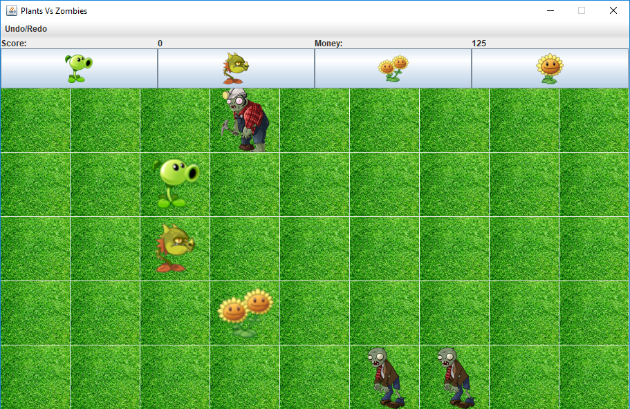
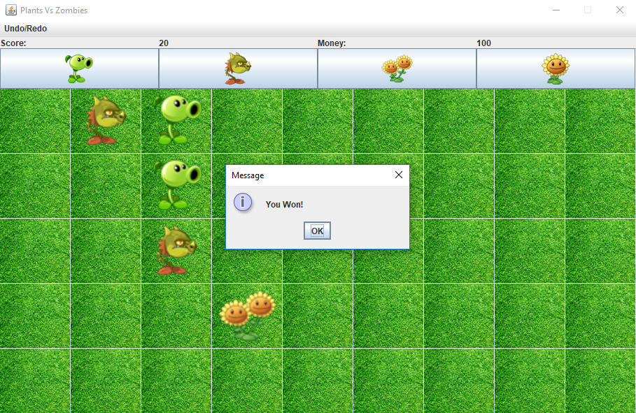
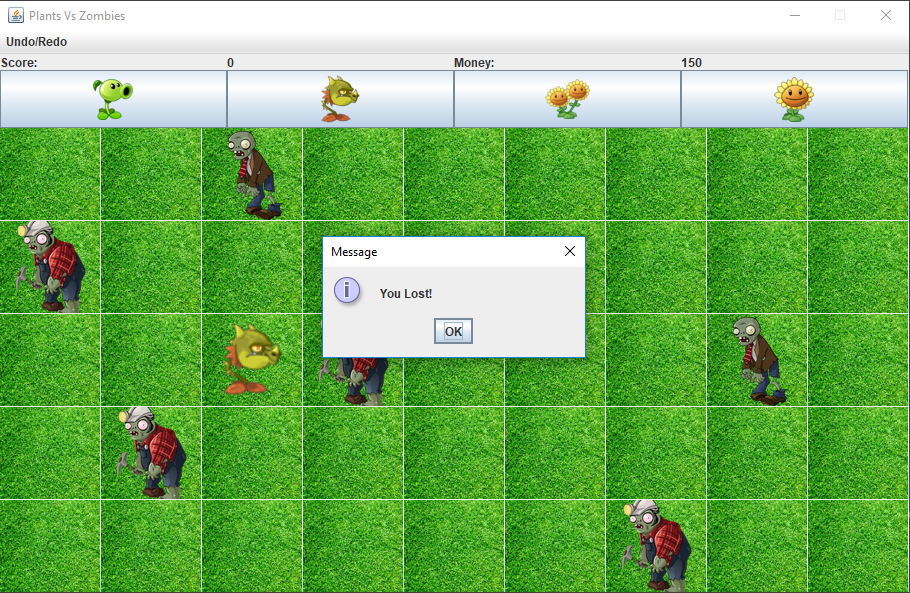

# Plants vs Zombies
SYSC 3110 - Third Year Project

## Folders description
- Documentation - Java doc generated from classes
- Diagrams - UML diagrams (Class and Sequence)
- Source - The project source code (.java files) and JUnit testing files

## Workload
- [Dominic (Dominic Kocjan)](@DomK123)
    * ~~Flower~~ -> Plant  
    * ~~XYFlower~~ -> ~~XYPlant~~ - depreciated
    * ~~MoneyFlower~~ -> MoneyPlant

- [Ahmed (Ahmed Romih)](@decarbonite)
    * ~~Beast~~ -> NPC
    * Zombie

- [Dima (Dmytro Sytnik)](@vanarman)
    * Board
    * BoardRow
    * BoardNode
    * Game

- [Mrunal (Mrunal Patel)](@mrunal-patel1997)
    * Player
    * GameRound

## Game specification and Design decisions

The current game is a step-by-step strategy game (simulation of the existing **Plats vs Zombies** game). In the current version, 
the game is working in real-time, using delay function to delay zombie's movement and the plants' shooting which makes it dynamic.
Plants are placed by the Player at anytime of the game as long as the money is sufficient. In order to win the game, 
Plants should kill all Zombies on a board. Currently, the game has only one round that generates 10 Zombies which could be changed by changing the value passed to zombiesToSpawn parameter in the Board initialization in Game class. 
Zombies are generated randomly at the beginning (right side) of the board.

The player can add plants to fight against Zombies and able to choose out of two types of plants:   
* **Plant** - Attack first available Zombie across a row were Plant is placed and damage it with 15 damage points.
* **MoneyPlant** - Cannot attack Zombies but generates in-game money which helps the player to buy more plants. In each step of the game, if a MoneyPlant is placed, it has 50% chance to increase money by 25 money points.

Each time Plant kills Zombie Player will be rewarded by score point (each Zombie worth 10 points).
Game continue until Plants will kill all Zombies (10) or at least one Zombie reaches the end of the board 
(left side) and kills the Plant in the last cell if exists.

##  User manual
1. When the game starts, the first look is like the picture below.

    

2. At the beginning of the game, the player has a few seconds to place plants before zombies start to appear on the board.
By clicking once on the Plant you want to choose from the top panel, the cursor image changes to that Plant image, then the player can choose which a cell on the board to place it by clicking on that cell as long as there is no other object already placed there. 

    
    
3. After the time delay is over the zombies will start to appear from the right side of the board, automatically moving towards the left side of the board.
            
    

4. The game ends either by the player winning; killing all zombies on the board and no more zombies are left to spawn, or losing in case of a zombie reaching the last cell at the left side of the board.

   When the player wins, a message pops up indicating victory like the picture below.
   
   

   When the player loses, a message pops up indicating that the player has lost like the picture below.
   
   
   
