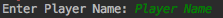
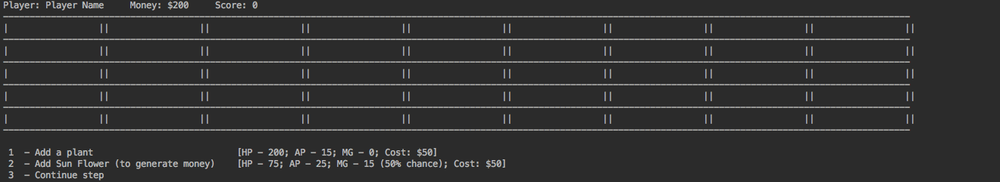
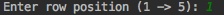
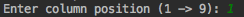
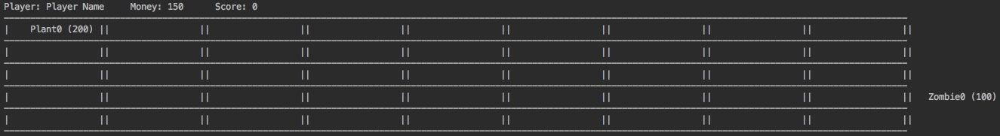
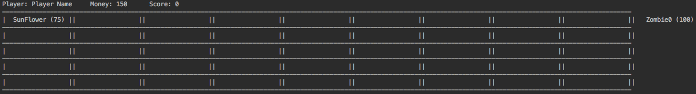
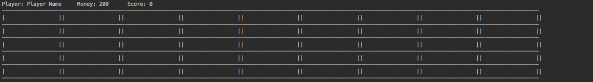

# Plants vs Zombies
SYSC 3110 - Third Year Project

## Folders description
- Documentation - Java doc generated from classes
- Diagrams - UML diagrams (Class and Sequence)
- Source - The project source code (.java files)

## Workload
- [Dominic (Dominic Kocjan)](@DomK123)
    * ~~Flower~~ -> Plant  
    * ~~XYFlower~~ -> ~~XYPlant~~ - depreciated
    * ~~MoneyFlower~~ -> MoneyPlant

- [Ahmed (Ahmed Romih)](@decarbonite)
    * ~~Beast~~ -> NPC
    * Zombie

- [Dima (Dmytro Sytnik)](@vanarman)
    * Board
    * BoardRow
    * BoardNode
    * Game

- [Mrunal (Mrunal Patel)](@mrunal-patel1997)
    * Player
    * GameRound

## Game specification and Design decisions

The current game is a step-by-step strategy game (simulation of the existing **Plats vs Zombies** game). In the current stage, 
the game is working in the console mode and does not have a dynamic component.
Plants are placed by the Player at the beginning of the game and after each step of the game. In order to win the game, 
Plants should kill all Zombies on a board. Currently, the game has only one round that generates, 20, one type of Zombies. 
Zombies are generating randomly at the beginning (right side) of the board.

The player can add plants to against Zombies and able to choose out of two types of plants:   
* **Plant** - Attack first available Zombie across a row were Plant is placed and damage it with 15 damage points.
* **Sun Flower** - Cannot attack Zombies but generates in-game money. In each step of the game, one Sun Flower generates with 50% of chance 25 money points.

Each time Plant kills Zombie Player will be rewarded by score point (each Zombie worth 10 points).
Game continue until Plants will kill all Zombies (20) or at least one Zombie reaches the end of the board 
(left side) and kills the Plant in the last cell if exists.

##  User manual
1. In order to start the game Player should specify its name as on-screen bellow.

    

2. At the beginning of the game, the player can place first plant (either fighting Plant or Sun Flower)
    
    
    
    * 1 - Add a plant (Adding fighting plant: **Health** 200; **Attack Power** 15; **Price** 50)
    
        When Player choose adding Plant, system will offer to specify where to place it:
        *  Enter row position (1 -> 5): eg. 1
        
        * Enter column position (1 -> 9): eg. 1
                
            
    
        
    * 2 - Add Sun Flower (Adding money-generator that cannot fight with zombies: **Health** 75; **Price** 50; **Money generates** 25 (50% chance per board update))
      
        When Player choose adding Sun Flower, system will offer to specify where to place it:
        *  Enter row position (1 -> 5): eg. 1
        
        * Enter column position (1 -> 9): eg. 1
        
                
    
    
    * 3 - Play with no plants for now (Continue with existing plants - next move)
    
        When Player choose to play with no plants, the system will print empty board
        
     

3. The game will loop step 2. until Plants will kill all Zombies or at least one Zombie reaches the end of the board with no Plant on the last cell.
